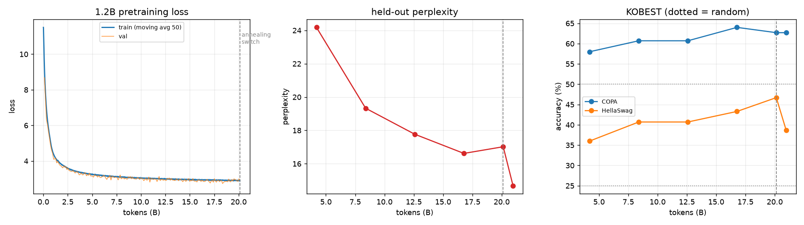

# llm_from_scratch — 한국어 1.2B LLM을 밑바닥부터

토크나이저부터 직접 만들어 **한국어 1.2B 대화 모델**을 완성한 기록입니다.
`transformers` 없이 순수 PyTorch로 구현했고, GPU 한 장(RTX 6000 Ada 48GB)에서
**25.2B 토큰**을 학습한 뒤 SFT까지 마쳤습니다.

| | |
|---|---|
| 모델 | decoder-only 1.2B (dim 2048 / 24층 / GQA 16:4 / ctx 2048) |
| 토크나이저 | byte-level BPE 64K, 한국어 코퍼스로 직접 학습 |
| 사전학습 | 25.2B 토큰 (24,000 step, RTX 6000 Ada ×1, 약 6주) |
| 정렬 | SFT (KoAlpaca + KULLM v2, 2 epoch) |
| 최종 | `checkpoints/sft_1b/latest.pt` |



## 결과 요약

**사전학습 (1.2B vs 같은 코드로 학습한 125M)**

| | 125M (2.6B 토큰) | **1.2B (25.2B 토큰)** | 무작위 |
|---|---|---|---|
| held-out perplexity | 34.0 | **13.87** | — |
| KOBEST COPA | 48.3% | **67.1%** | 50% |
| KOBEST HellaSwag | 28.3% | **40.0%** | 25% |
| KOBEST BoolQ | 49.3% | 50.0% | 50% |

**SFT 후 (학습 데이터와 겹치지 않는 자체 문항 36개 + KOBEST 전체)**

| | 대화 정답률 | 스스로 멈춤 | 반복 루프 | COPA | HellaSwag |
|---|---|---|---|---|---|
| 베이스 | 71.0% | 92% | 11% | 67.1% | 40.0% |
| SFT 에폭0 | 67.7% | 100% | 3% | 66.9% | 40.8% |
| **SFT 최종** | **74.2%** | 97% | 8% | 66.4% | 40.8% |

유형별로는 **사실 100%, 지시 50%, 계산 0%**입니다. 자세한 수치와 해석은
[docs/RESULTS.md](docs/RESULTS.md), 모델별 답변 전문은
[logs/sft_eval_answers.md](logs/sft_eval_answers.md)에 있습니다.

```
Q: 조선을 건국한 사람은 누구야?
A: 조선은 이성계라는 인물이 건국한 나라입니다. 이성계는 고려 말기의 권문세족으로,
   이성계의 아버지 이자춘은 공민왕, 이성계의 형인 이원계는 우왕, ...
   → 핵심(이성계)은 맞히지만 세부는 그럴듯하게 지어냅니다

Q: 'Good morning'을 한국어로 번역해줘.
A: "굿모닝"은 "좋은 아침"으로 번역할 수 있습니다.

Q: 6 곱하기 7은 얼마야?
A: 6 곱하기 7의 결과는 28입니다.
   → 계산은 전혀 못 합니다
```

## 무엇을 직접 만들었나

`datasets`(코퍼스 다운로드)와 PyTorch(행렬 연산·자동미분)를 빼면 전부 이 저장소 안에 있습니다.

- **BPE 토크나이저** — 증분 쌍 빈도 갱신 + inverted index + lazy-deletion heap으로
  500MB 코퍼스에서 64K vocab을 18.6분에 학습 ([tokenizer/bpe.py](tokenizer/bpe.py))
- **트랜스포머** — RMSNorm · RoPE · GQA · QK-Norm · SwiGLU · embedding tying.
  교육용 명시적 attention과 FlashAttention 경로를 모두 두고 단위테스트로 일치 검증
  ([model.py](model.py))
- **청크 cross-entropy** — 64K vocab에서 logits만 8.6GB가 되는 문제를
  gradient checkpointing으로 해결 ([model.py](model.py)의 `chunked_cross_entropy`)
- **데이터 파이프라인** — 스트리밍 다운로드 → 품질 필터 → MinHash 중복제거 →
  토크나이즈 → shard ([data/](data/))
- **품질 분류기** — 위키·교과서를 positive, 원본 웹을 negative로 학습한 해시 특징
  로지스틱 회귀(numpy 직접 구현), held-out 정확도 98.3% ([data/quality.py](data/quality.py))
- **학습 루프** — WSD 스케줄, bf16, torch.compile, gradient accumulation,
  원자적 체크포인트, 완전 재개 ([train.py](train.py))
- **평가** — perplexity, KOBEST(비조건부 정규화 + 예측 쏠림 감지), 오염 검사
  ([eval.py](eval.py), [evals/](evals/))

## 전체 재현 절차

```bash
python3.13 -m venv .venv && source .venv/bin/activate
pip install -r requirements.txt

# 0) 구현 검증 (GPU 불필요, 1분)
python -m tokenizer.test_bpe      # BPE 왕복·압축률
python test_model.py              # attention 일치, 초기 loss=ln(V), 오버핏, KV 캐시, 청크 CE

# 1) 토크나이저 (약 20분, CPU 다중코어)
python -m tokenizer.train_tokenizer --sample-mb 500 --vocab-size 65536

# 2) 데이터 (약 2시간, 디스크 45GB)
python -m data.prepare --tokens 26e9 --workers 40

# 3) 품질 분류기 + annealing 데이터 (약 2시간, 디스크 9GB)
python -m data.train_quality --n 8000
python -m data.prepare_anneal --tokens 5.2e9 --workers 40

# 4) 사전학습 (RTX 6000 Ada 1장 기준 약 6주)
./run_training.sh base_1b data/shards_26b        # 죽으면 자동 재개
./watch_milestones.sh &                          # 스냅샷 생길 때마다 자동 평가

# 5) 평가
python final_eval.py

# 6) SFT (약 5.5시간)
python sft.py --base checkpoints/base_1b/latest.pt --config sft_1b
python sft_eval.py

# 7) 대화
python sample.py --ckpt checkpoints/sft_1b/latest.pt --chat
```

작은 규모로 먼저 검증하려면 `--config debug_30m`(노트북) 또는 `mid_125m`(GPU 반나절)을
쓰세요. 서버 운영·재개·모니터링은 [docs/OPERATIONS.md](docs/OPERATIONS.md)에 있습니다.

## 저장소 구조

```
model.py                 트랜스포머 (RMSNorm/RoPE/GQA/QK-Norm/SwiGLU) + 청크 CE + KV 캐시 생성
train.py                 사전학습 루프 (WSD, bf16, compile, annealing 전환, 원자적 체크포인트)
sft.py                   SFT (chat template, assistant 토큰만 loss)
sample.py                생성 / --chat 대화 데모
eval.py                  perplexity + KOBEST (비조건부 정규화, 예측 쏠림 감지)
final_eval.py            사전학습 최종 평가 (annealing 전/후 비교)
sft_eval.py              SFT 평가 (자체 문항 + KOBEST)
bench.py                 처리량·VRAM 벤치마크
test_model.py            모델 검증 6종

tokenizer/               byte-level BPE 구현·학습·테스트 + 학습된 64K vocab
data/                    다운로드·정제·중복제거·품질분류·토크나이즈·데이터로더
configs/                 debug_30m · mid_125m · base_1b · sft_1b (+ 스모크용)
evals/                   자체 평가 문항 + 학습데이터 오염 검사
docs/                    결과 정리, 운영 가이드, 그래프
logs/                    학습 곡선, 마일스톤, 평가 결과 원본
```

체크포인트(모델당 14GB)와 데이터 shard(54GB)는 용량상 저장소에 없습니다.

## 하드웨어와 비용

RTX 6000 Ada 48GB **한 장**으로 전부 했습니다. 벤치마크로 고른 설정은
마이크로배치 2 × 2048토큰(26GB)이며, 처리량은 11K tok/s였습니다.

배치를 4로 키우면 34.7K tok/s가 나왔지만 VRAM이 34.7GB로 늘어, 같은 GPU를 쓰는
다른 작업(vLLM 등)이 뜰 때마다 OOM으로 죽었습니다. **공유 자원에서는 최적값보다
완주 가능성이 중요**하다는 판단으로 배치 2를 택했고, 결과적으로 실제 처리량도 더 좋았습니다.

## 한계

- **계산 불가** — 12+7을 14라고 답합니다. 이 규모·데이터로는 개선되지 않습니다.
- **드문 사실은 지어냅니다** — 산 높이, 화학식 같은 수치는 매번 다르게 답합니다.
- **BoolQ 실패** — 전 구간에서 예측이 한쪽으로 쏠려 무작위 수준입니다.
- **annealing의 부작용** — 고품질 데이터 전환으로 perplexity는 26% 좋아졌지만
  HellaSwag은 46.2% → 40.0%로 떨어졌습니다. 웹의 서사 텍스트를 너무 줄인 탓으로 보입니다.
- **SFT 데이터 오염** — annealing에 SFT와 같은 데이터를 넣어 SFT 검증 loss가
  일반화가 아니라 기억을 재고 있었습니다. 그래서 별도 문항을 만들어 평가했습니다.

자세한 내용과 그 과정에서 배운 것은 [docs/RESULTS.md](docs/RESULTS.md)에 정리했습니다.
